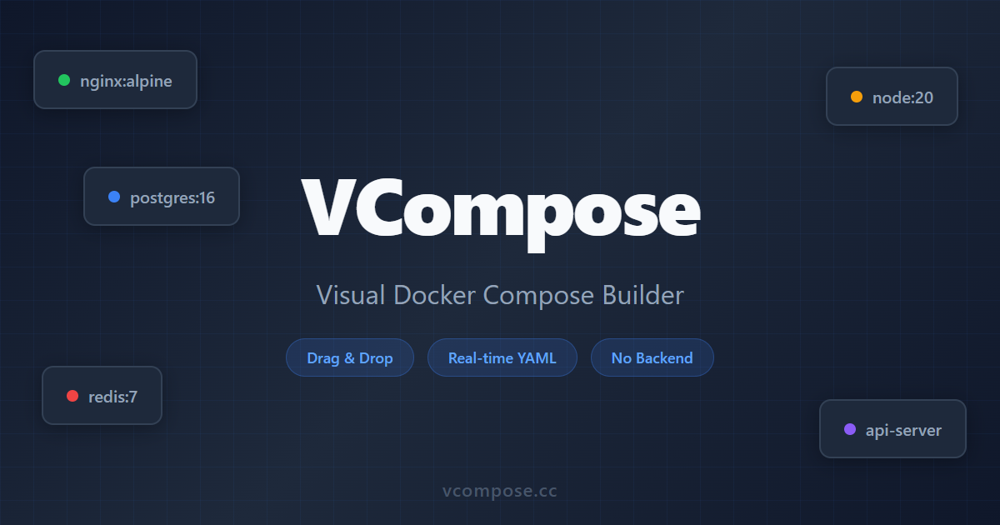

# VCompose

**Visual Docker Compose Builder** — Build `docker-compose.yml` files with drag-and-drop. No signup, no backend, runs entirely in your browser.

[**Try it now at vcompose.cc**](https://vcompose.cc)



---

## Features

- **Drag & drop services** — Add nginx, postgres, redis, node or custom services to a visual canvas
- **Connect to define dependencies** — Draw edges between services to auto-generate `depends_on`
- **Real-time YAML** — See your `docker-compose.yml` update live as you build
- **Auto network config** — Services are automatically added to shared networks when connected
- **YAML import** — Paste existing compose files to visualize and edit them
- **Copy & download** — One-click copy to clipboard or download as `.yml`
- **Undo / Redo** — Full undo/redo support with keyboard shortcuts (Ctrl+Z / Ctrl+Y)
- **Persistent** — Your work is saved in localStorage automatically

## Quick Start

### Use online

Visit [**vcompose.cc**](https://vcompose.cc) — no installation needed.

### Run locally

```bash
git clone https://github.com/zbrave/vcompose.git
cd vcompose
npm install
npm run dev
```

Open `http://localhost:5173`.

## Tech Stack

| Layer | Choice |
|-------|--------|
| Framework | React 18 + TypeScript (strict) |
| Bundler | Vite |
| Canvas | React Flow v11+ |
| State | Zustand |
| Styling | Tailwind CSS |
| YAML | `yaml` npm package |
| Testing | Vitest + Playwright |

## How It Works

1. **Drag** a service preset from the sidebar onto the canvas
2. **Configure** the service — image, ports, volumes, environment variables, healthcheck
3. **Connect** services by drawing edges to define `depends_on` relationships
4. **Copy** the generated YAML from the output panel

## Self-Hosting

```bash
docker build -t vcompose .
docker run -p 80:80 vcompose
```

Or use the pre-built image with any container platform (Coolify, Railway, etc).

## Contributing

Contributions are welcome! Please open an issue first to discuss what you'd like to change.

```bash
npm run test      # Unit tests (Vitest)
npm run test:e2e  # E2E tests (Playwright)
npm run lint      # ESLint
npm run format    # Prettier
```

## License

MIT
