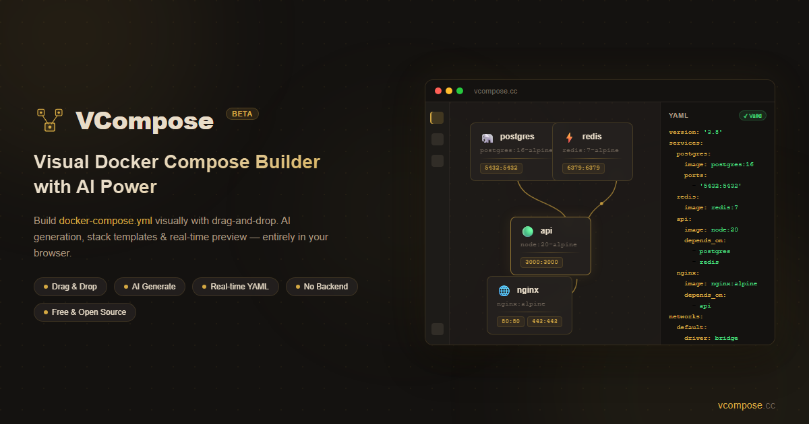

<p align="center">
  
</p>

<h1 align="center">VCompose</h1>

<p align="center">
  <strong>Visual Docker Compose Builder</strong> — drag-and-drop your <code>docker-compose.yml</code> in the browser.
</p>

<p align="center">
  <a href="https://vcompose.cc"></a>
</p>

<p align="center">
  <a href="https://github.com/zbrave/vcompose/stargazers"></a>
  <a href="https://github.com/zbrave/vcompose/blob/master/LICENSE"></a>
  
  
  
</p>

<p align="center">
  
</p>

---

## Why VCompose?

Writing `docker-compose.yml` by hand means juggling indentation, remembering image tags, and cross-referencing `depends_on` entries. VCompose replaces all of that with a visual canvas — **drag services, draw connections, get production-ready YAML.**

No signup. No backend. No data leaves your browser.

---

## Features

| | Feature | Description |
|---|---|---|
| **Canvas** | Drag & Drop | 111+ services and 16 pre-built stacks |
| **Edges** | Dependencies | Draw connections to auto-generate `depends_on` |
| **YAML** | Real-time Preview | Live YAML output with syntax highlighting |
| **AI** | Generate with AI | Describe in natural language — supports OpenAI, Anthropic, Gemini, GLM |
| **IDE** | MCP Integration | Use from Claude, Cursor, or any MCP-compatible tool |
| **Import** | YAML Import | Paste existing compose files to visualize them |
| **Smart** | Recommendations | Get companion service suggestions (pgadmin for postgres, etc.) |
| **Networks** | Auto Config | Services auto-join shared networks when connected |
| **Undo** | Ctrl+Z / Ctrl+Y | Full undo/redo with keyboard shortcuts |
| **Save** | Persistent | Work auto-saved to localStorage |

---

## Quick Start

### Use online (recommended)

**[vcompose.cc](https://vcompose.cc)** — zero install, works immediately.

### Run locally

```bash
git clone https://github.com/zbrave/vcompose.git
cd vcompose
npm install
npm run dev
```

Open [localhost:5173](http://localhost:5173).

### Self-host with Docker

```bash
docker build -t vcompose .
docker run -p 80:80 vcompose
```

Works with any container platform — Coolify, Railway, etc.

---

## How It Works

```
1. Drag      →  Add a service from the sidebar
2. Configure →  Set image, ports, volumes, env vars
3. Connect   →  Draw edges for depends_on
4. Export    →  Copy or download your docker-compose.yml
```

---

## Tech Stack

| Layer | Choice |
|-------|--------|
| Framework | React 18 + TypeScript (strict) |
| Bundler | Vite |
| Canvas | React Flow v12 |
| State | Zustand |
| Styling | Tailwind CSS |
| YAML | `yaml` npm package |
| AI | Vercel AI SDK (4 LLM providers) |
| Animation | Framer Motion |
| Testing | Vitest + Playwright |

---

## MCP Server

VCompose includes an MCP server for IDE integration. Use it with Claude, Cursor, or any MCP-compatible AI tool.

**Tools available:**
- `generate-compose` — Generate from description
- `validate-compose` — Validate YAML
- `parse-compose` — Parse to visual format
- `get-recommendations` — Get companion services

[Read MCP docs →](https://vcompose.cc/mcp)

---

## Contributing

Contributions welcome! Please open an issue first to discuss what you'd like to change.

```bash
npm run test      # Unit tests (Vitest)
npm run test:e2e  # E2E tests (Playwright)
npm run lint      # ESLint
npm run format    # Prettier
```

---

## Star History

If VCompose saves you time, consider giving it a star — it helps others find it!

[](https://star-history.com/#zbrave/vcompose&Date)

---

## License

MIT
